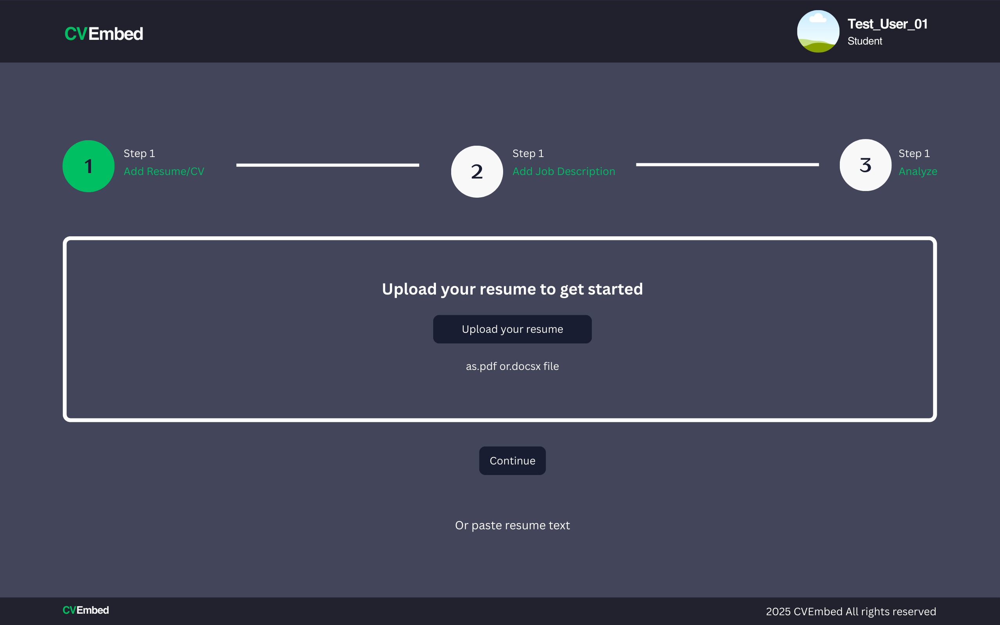
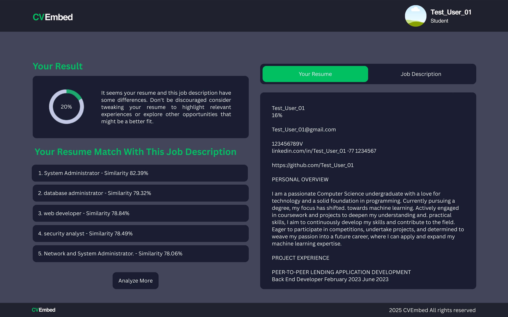

**Project Name**

# AI‑Based Applicant Tracking & CV Matching System

**Overview**
This open‑source project implements an AI‑powered applicant tracking and CV matching platform designed to help recruiters and hiring managers streamline candidate screening. Using state‑of‑the‑art embedding models and vector search technology, the system automatically ranks and recommends the best fit candidates based on resumes (CVs) and job descriptions.

---

## Key Features

* **Automated CV Screening**
  Converts uploaded CVs into dense vector embeddings and retrieves top matching job postings.

* **Job Posting Ingestion**
  Supports bulk import of job descriptions from CSV or database sources.

* **Real‑Time Matching**
  On CV upload, instantly returns the top N (configurable) matching jobs sorted by similarity.

* **Customizable Thresholds**
  Define similarity score cutoffs to control which candidates advance to the next stage.

* **Dashboard & Analytics**
  Simple web interface showing matching scores, candidate summaries, and aggregate statistics.

* **System Interface**
  Provides an intuitive user interface comprising:

  * **Login Page**: Secure authentication with email/password or SSO.
  * **Dashboard**: High‑level metrics, recent activity feed, and quick‑access controls.
  * **CV Upload Page**: Drag‑and‑drop or paste CV text with instant validation and feedback.
  * **Match Results Page**: Ranked list of matching job openings with similarity scores, filters (score threshold, job type), and export options.

---

## Technology Stack

* **Frontend**: React (Vite)
* **Backend**: Flask (Python)
* **Embedding Model**: Sentence‑BERT (SBERT)
* **Vector DB**: Milvus
* **Containerization**: Docker & Docker Compose

## Website Interface

### 1. Resume Upload Page

* **Users can upload or paste their resumes on this page
* 

### 2. Results Page

* **This page displays the top 5 job descriptions that match the uploaded resume.
* 

---

## Installation & Setup

### 1. Clone Repository

```bash
git clone https://github.com/Samitha-Edirisinghe/Ai-applicant-tracker.git
cd ai‑applicant‑tracker
```

### 2. Using Docker (Recommended)

```bash
# Build and start all containers
docker-compose up --build
```

* **Frontend**: [http://localhost:3000](http://localhost:3000)
* **Backend API**: [http://localhost:5000](http://localhost:5000)
* **Milvus**: listens on port 19530

To tear down:

```bash
docker-compose down -v
```

### 3. Manual Setup (Without Docker)

#### a. Backend & Milvus

```bash
cd server
python3 -m venv venv
source venv/bin/activate    # Windows: venv\Scripts\activate
pip install -r requirements.txt
```

* **Start Milvus**

  ```bash
  ```

docker run -d --name milvus -p 19530:19530 milvusdb/milvus\:latest

````
- **Build Embeddings & Index**  
  ```bash
cd ../model
python build_index.py
````

* **Run Flask Server**

  ```bash
  ```

cd ../server
export FLASK\_APP=app.py      # Windows: set FLASK\_APP=app.py
flask run                    # [http://127.0.0.1:5000](http://127.0.0.1:5000)

````

#### b. Frontend
```bash
cd client
npm install
npm run dev                  # http://localhost:3000
````

---

## Usage

1. Navigate to the web UI.
2. Upload or paste a candidate's CV.
3. View and filter the list of matching job openings by similarity score.
4. Export candidate‑job match reports as CSV.

---

## Data Sources & Models

* **Embedding Model**: [bwbayu/sbert\_model\_jobcv](https://huggingface.co/bwbayu/sbert_model_jobcv)
* **Sample Datasets**:

  * Kaggle: IT Job Descriptions, Resume Datasets
  * Hugging Face: Resume‑Job Fit dataset

---

## License

This project is licensed under the MIT License — see the [LICENSE](LICENSE) file for details.
